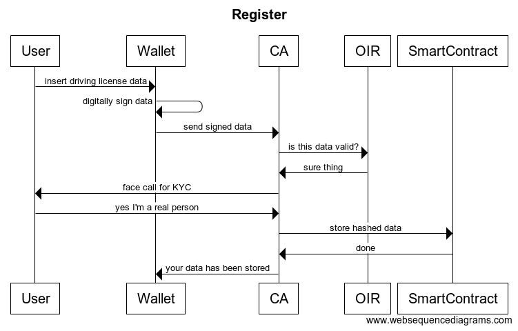
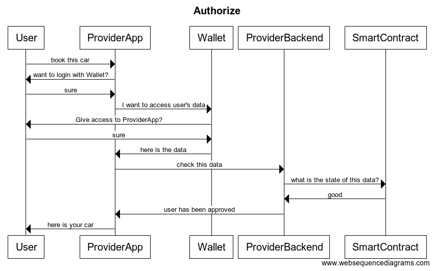

Hello there, this project is a proof of concept, and it's not intended to be used in production.

# Driving License wallet initiative
TL;DR: unlock cars by using your digital driving license.

## Problem
Signing up for a car sharing service requires users to go through a [Know Your Customer](https://en.wikipedia.org/wiki/Know_your_customer) (KYC) process. This process has to be repeated each time a user wants to sign up to a new, different service. Moreover, the KYC fee is often paid by users themselves. That's pretty frustrating: as a user, why should I pay for KYC if I did it already? Why should I wait days to get access to the car sharing service? As a car sharing provider: KYC has a negative impact on the conversion rate, I'm losing money.

Right now, the flow is roughly the following:
- Alice is a potential user of BobCars.
- BobCars asks Alice to go through the KYC process using a third-party service.
- Alice goes through the KYC.
- BobCars stores the KYC result (certification) in its database.
- Alice can now use BobCars.

The result of the KYC is stored in BobCars database, and it's not accessible to anyone but BobCars. If Alice wants to use another car sharing provider, she has to go through (and pay) the KYC process again.

## Solution
The idea is to allow users to go through KYC only once, by reusing multiple times their certified data. Roughly speaking, users store their information in their phones (in an so-called "wallet app"), and reveal all their information (or a subset) to the car sharing service. User's information includes: first name, last name, address, ..., and driving license data. This information is vetted and digitally signed by a Certification Authority, and stored in a decentralized database. The car sharing service can then verify the validity of the information by querying that decentralized database. An example of decentralized database is the Ethereum blockchain.

## This is a protocol, not a product (but we have a reference implementation).
The intent of this project is to define a **protocol** that any car sharing provider might integrate in their services. Our initiative might develop tools to use as a **reference implementation** of the protocol, as well as a **reference wallet** to store user's personal data.

It's on the providers' hands to use the reference implementation of the protocol or develop its own.

It's on the users' hands to download and use the **reference wallet** or develop new wallets.

Think about this as the `http` protocol. The protocol is free and open, you don't have to pay to use `http`. There are several browsers that can talk `http`, some free-open source, some other closed source. There are multiple implementations of web servers, some free-open source, some closed source.

# Specification
In this section we describe the scope of the project and the components of our proof of concept.

## Terminology
- **User**: A person who wants to use a car sharing service.
- **Personal Data**: Any piece of information that is private by nature, and belongs to a person.
- **Wallet**: A smartphone application to store, manage, and eventually share **Personal Data**.
- **Official Identity Registry**: a (governmental) entity that is able to validate user's **Personal Data**.
- **Certification Authority**: a trusted organization that verifies the authenticity of claims, signs them and generates verifiable claims.
- **Provider**: an entity that needs access to the user's **Personal Data** to offer a service (e.g. a car sharing provider).
- **Ledger**: a decentralized, permissionless database (e.g. the [Ethereum blockchain](https://ethereum.org/)).
- **Keypair**: a tuple `<private key, public key>` used to digitally sign and verify transactions and statements.

## Scope
To keep the project small and simple, we restricted the scope of the Personal Data that a user can share. Specifically, we deal with name, last name, date of birth, place of birth, address, phone number and, of course, **driving license data**. Moreover, for now users cannot selectively share a subset if their information.

Note that many open initiatives are currently working on similar problems. Some of the related initiatives and projects are:
- [Decentralized Identity Foundation](https://identity.foundation/)
- [DID Specification](https://w3c-ccg.github.io/did-spec/)
- [Verifiable Claims use cases](https://www.w3.org/TR/verifiable-claims-use-cases/)
- [W3C Verifiable Claims Working Group](https://www.w3.org/2017/vc/WG/)
- [Verifiable Claims use cases](https://www.w3.org/TR/verifiable-claims-use-cases/)
- [Verifiable Claims data model](https://www.w3.org/TR/verifiable-claims-data-model/)
- [Decentralized Key Management System](https://github.com/WebOfTrustInfo/rebooting-the-web-of-trust-spring2017/blob/master/topics-and-advance-readings/dkms-decentralized-key-mgmt-system.md)

If this proof of concept gets traction, we will embrace W3C standards.

For simplicity, we have only one Certification Authority. This constraint will be relaxed in the future.

## Proof of Concept
In our proof of concept we simulate the interactions between:
1. Alice and the Wallet, to go though the KYC process (this happens only once).
2. Alice and a car sharing Provider called BobCars, to reserve a car immediately, even if she is **not** yet a user of the service.

To demonstrate the proof of concept, we developed and open sourced multiple apps and services, specifically:
- The [Wallet](https://github.com/urbi-mobility/urbi-wallet), a proof of concept Ethereum wallet (built with React Native), that allows Alice to store and register her personal data. More in details it can:
  - Create a keypair.
  - Input Personal Data (driving license).
  - Upload to Certification Authority.
  - Store claims in local storage.
  - Manage authentication flow.
- The [Certification Authority Server](https://github.com/urbi-mobility/urbi-ca-server), that simulates the KYC process to validate the data that Alice inserts in the Wallet. It can:
  - Receive Personal Data.
  - Verify against an Official Identity Registry.
  - Hash Personal Data and sign the claim.
  - Store the claim in the Ledger.
- The [Provider App](https://github.com/urbi-mobility/provider-app), a mock app for a sharing mobility provider, namely BobCars. It can:
  - Activate the Wallet to register the user.
  - Get the data from the Wallet, and submit it to the Provider Server (specified below) to register the user.
- The Provider Server, that is the backend for the Provider App (BobCars). It can:
  - Expose an endpoint to receive the Personal Data from the Wallet app.
  - Verify data authenticity.
- The [Registry Smart Contract](https://github.com/urbi-mobility/contracts) to store the certification proofs. It can:
  - Manage a single Certification Authority (this is to simplify the project).
  - Store claims associated to a user.
  - Given a user, return the claim.


### Use case: registration
Alice wants to register her driving license. To do that, she installs the Wallet app, and inserts her personal data. When she is ready, she sends her data to the Certification Authority (CA). The Certification Authority contacts the Official Identity registry (OIR) to verify that the driving license data is correct. After that, the Certification Authority has a face to face call with Alice, to verify she is the actual person she claims to be. If the call is successful, the Certification Authority hashes the data that Alice provided, and makes a transaction to talk to the smart contract in the Ethereum Network. The smart contract contains now a signed claim of Alice's data.



### Use case: authorization
Alice wants to reserve a car with BobCars. She is not a user and she needs to register. She opens the BobCars app and she taps on *Sign up with your Wallet*. The Provider App (BobCars) opens the Wallet. The Wallet asks Alice if she really wants to share her information with BobCars. She agrees, and the Wallet shares the data with the BobCars app. BobCars app asks its backend to store Alice data and to sign her up. The backend checks if the Registry Smart Contract has a claim associated with Alice that is signed by a trusted Certification Authority. Since that's true, Alice is now signed in BobCars and she can immediately use the car.



# Why Blockchain?
In April 2018, the World Economic Forum released the report [Blockchain Beyond the Hype—A Practical Framework for Business Leaders](https://www.weforum.org/whitepapers/blockchain-beyond-the-hype). The report provides a *decision tree* "to enable rapid initial analysis of whether blockchain is an appropriate solution for a defined problem". The 11 questions (and answers) in the decision tree are the following.

**Are you trying to remove intermediaries or brokers?**<br />
Yes. As we write in the problem statement, today's data is centralized in few identity verification platforms.

**Are you working with digital assets (versus physical assets)**<br />
Yes. The digital asset is the certification that you can drive a vehicle (a.k.a. driving license).

**Can you create a permanent authoritative record of the digital asset inquestion?**<br />
Yes, once a driving license has been validated, it might take up to 10 years to expire. There are other events that can occur in the meantime: a driving license is lost/stolen, or voided. Depending on the infrastructure provided by the Official Identity Registry, this information can be obtained immediately or with some delay. In any case, the responsibility of the Certification Authority is to update the record in the smart contract.

**Do you require high performance, rapid (~millisecond) transactions?**<br />
No. The process to validate a driving license and go through KYC of the user takes minutes. Once the process is done, we don't care if the process of registering the driving license in the blockchain takes few seconds or few minutes.

**Do you intend to store large amounts of non-transactional data as part of your solution?**<br />
No. For each registration, we estimate the amount of data stored to be less than 160 bytes.

**Do you want/need to rely on a trusted party? (e.g., for compliance or liability reasons)**<br />
No. The system is designed to work across Europe (or even beyond it), and it needs to rely on **multiple** trusted parties/governments, specifically multiple Official Identity Registries.

**Are you managing contractual relationships or value exchange?**<br />
Yes. The value is being able to validate the driving license of a user.

**Do you require shared write access?**<br />
Yes. The system allows multiple Certification Authorities to write data in the same smart contract.

**Do contributors know and trust each other?**<br />
No. Certification Authorities don't need to trust each other.

**Do you need to be able to control functionality?**<br />
No. Anyone can become a Certification Authority. But not everyone trusts all Certification Authorities.

**Should transactions be public?**<br />
Yes. All proof and signatures are public.

# FAQ
## Is it safe?
**Data stored in the blockchain is :100:% public. How can you preserve users' privacy while storing things in the public?**

Thanks for your question. The decentralized registry stores only the hash of the user's private information, and it's mathematically unfeasible to revert a hash.

# Run the code!

## Registry contract
The `Registry.sol` contract maps an address (a "user id") to a certified proof.

# How does it work?
Check out the [example](./example/index.js) to see how the flow for registration and authentication works.

# How to run
Make sure to have truffle installed. You also need a development Ethereum node to test the contract and run the example. You can use `ganache-cli` or [`ethnode`](https://github.com/vrde/ethnode).

```
npm i
truffle migrate
node example/index.js
```


